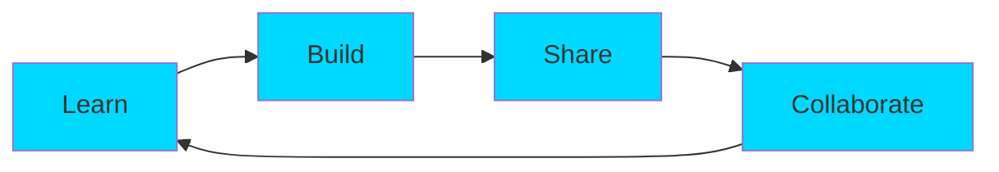

<div align="center">

# 🌌 Welcome to Soham's Digital Universe 🌌


<br/>

[](https://git.io/typing-svg)

<br/>

```ascii
╔═══════════════════════════════════════════════════════════════╗
║  "Technology is best when it brings people together" 💙       ║
╚═══════════════════════════════════════════════════════════════╝
```


</div>

---

<div align="center">

## 🎮 3D Contribution Graph


<picture>
  <source media="(prefers-color-scheme: dark)" srcset="https://raw.githubusercontent.com/work4soham/work4soham/output/github-contribution-grid-snake-dark.svg">
  <source media="(prefers-color-scheme: light)" srcset="https://raw.githubusercontent.com/work4soham/work4soham/output/github-contribution-grid-snake.svg">
  
</picture>

</div>

---


<div align="center">

## 🚀 About The Developer


</div>

```typescript
const Soham = {
    pronouns: "He" | "Him",
    location: "Mumbai, India 🇮🇳",
    code: ["C++", "C", "Python", "JavaScript"],
    askMeAbout: ["Arduino", "IoT", "Embedded Systems", "Robotics"],
    technologies: {
        hardware: {
            microcontrollers: ["Arduino", "ESP32", "Raspberry Pi"],
            sensors: ["DHT22", "MPU6050", "HC-SR04"],
            communication: ["I2C", "SPI", "UART", "Bluetooth", "WiFi"]
        },
        software: {
            embedded: ["Arduino IDE", "PlatformIO"],
            languages: ["C++", "Python", "Assembly"],
            tools: ["Git", "VS Code", "Proteus"]
        }
    },
    currentFocus: "Building IoT projects that make life easier",
    funFact: "I debug hardware with LEDs and software with console.log() 😄"
};
```

<br/>

---


<div align="center">

## ⚡ Power Stats & Achievements


<br/><br/>


<br/><br/>

### 🏆 GitHub Trophies


</div>

---


<div align="center">

## 🛠️ Tech Arsenal

### Programming Languages


### Hardware & Embedded


### Tools & Platforms


<br/>

### 📊 Language Distribution


</div>

---


<div align="center">

## 🔥 Featured Projects

<table>
<tr>
<td width="50%">

### 🤖 Arduino Projects


**Exploring microcontrollers & embedded systems**
- 🔧 Hardware interfacing
- 💡 Sensor integration
- 🌐 IoT connectivity

</td>
<td width="50%">

### 🚀 More Coming Soon!


**Building innovative projects**
- 🏠 Home automation
- 🤖 Robotics systems
- 📡 Wireless communication

</td>
</tr>
</table>

</div>

---


<div align="center">

## 📈 Contribution Graph


<br/>

### 🐍 Watch the Snake Eat My Contributions!

<picture>
  <source media="(prefers-color-scheme: dark)" srcset="https://raw.githubusercontent.com/platane/snk/output/github-contribution-grid-snake-dark.svg">
  <source media="(prefers-color-scheme: light)" srcset="https://raw.githubusercontent.com/platane/snk/output/github-contribution-grid-snake.svg">
  
</picture>

</div>

---


<div align="center">

## 📫 Connect With Me

<a href="https://github.com/work4soham">
  
</a>


<br/><br/>

### 👀 Profile Views & Followers


</div>

---

<div align="center">

## 💭 Random Dev Quote


</div>

---

<div align="center">

## 🎯 Current Objectives



### 📅 2025 Goals
- [ ] 🔥 100+ GitHub Contributions
- [ ] 🚀 Launch 5 IoT Projects
- [ ] 📚 Master ESP32 & ESP8266
- [ ] 🤝 Contribute to 10 Open Source Projects
- [ ] 📝 Write Technical Blogs
- [ ] 🎓 Complete Advanced Embedded Systems Course

</div>

---


<div align="center">

## 🎵 Currently Vibing To


*Replace YOUR_SPOTIFY_ID with your actual Spotify ID if you want to show what you're listening to!*

</div>

---

<div align="center">

## ⚡ Fun Fact


</div>

---


<div align="center">

### 💙 Show some love by starring ⭐ some repositories!


**Made with ❤️ and lots of ☕**

</div>
