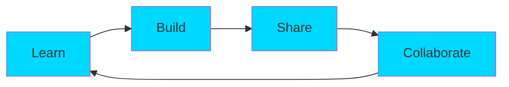

<div align="center">

# 🌌 Welcome to Soham's Digital Universe 🌌


<br/>

[](https://git.io/typing-svg)

<br/>

```ascii
╔═══════════════════════════════════════════════════════════════╗
║  "Technology is best when it brings people together" 💙       ║
╚═══════════════════════════════════════════════════════════════╝
```


</div>

---

<div align="center">

## 🎮 3D Contribution Graph


<picture>
  <source media="(prefers-color-scheme: dark)" srcset="https://raw.githubusercontent.com/work4soham/work4soham/output/github-contribution-grid-snake-dark.svg">
  <source media="(prefers-color-scheme: light)" srcset="https://raw.githubusercontent.com/work4soham/work4soham/output/github-contribution-grid-snake.svg">
  
</picture>

</div>

---


<div align="center">

## 🚀 About The Developer


</div>

```typescript
const Soham = {
    pronouns: "He" | "Him",
    location: "Mumbai, India 🇮🇳",
    code: ["C++", "C", "Python", "JavaScript"],
    askMeAbout: ["Arduino", "IoT", "Embedded Systems", "Robotics"],
    technologies: {
        hardware: {
            microcontrollers: ["Arduino", "ESP32", "Raspberry Pi"],
            sensors: ["DHT22", "MPU6050", "HC-SR04"],
            communication: ["I2C", "SPI", "UART", "Bluetooth", "WiFi"]
        },
        software: {
            embedded: ["Arduino IDE", "PlatformIO"],
            languages: ["C++", "Python", "Assembly"],
            tools: ["Git", "VS Code", "Proteus"]
        }
    },
    currentFocus: "Building IoT projects that make life easier",
    funFact: "I debug hardware with LEDs and software with console.log() 😄"
};
```

<br/>

---


<div align="center">

## ⚡ Power Stats & Achievements


<br/><br/>


<br/><br/>

### 🏆 GitHub Trophies


</div>

---


<div align="center">

## 🛠️ Tech Arsenal

### Programming Languages


### Hardware & Embedded


### Tools & Platforms


<br/>

### 📊 Language Distribution


</div>

---


<div align="center">

## 🔥 Featured Projects

<table>
<tr>
<td width="50%">

### 🤖 Arduino Projects


**Exploring microcontrollers & embedded systems**
- 🔧 Hardware interfacing
- 💡 Sensor integration
- 🌐 IoT connectivity

</td>
<td width="50%">

### 🚀 More Coming Soon!


**Building innovative projects**
- 🏠 Home automation
- 🤖 Robotics systems
- 📡 Wireless communication

</td>
</tr>
</table>

</div>

---


<div align="center">

## 📈 Contribution Graph


<br/>

### 🐍 Watch the Snake Eat My Contributions!

<picture>
  <source media="(prefers-color-scheme: dark)" srcset="https://raw.githubusercontent.com/platane/snk/output/github-contribution-grid-snake-dark.svg">
  <source media="(prefers-color-scheme: light)" srcset="https://raw.githubusercontent.com/platane/snk/output/github-contribution-grid-snake.svg">
  
</picture>

</div>

---


<div align="center">

## 📫 Connect With Me

<a href="https://github.com/work4soham">
  
</a>


<br/><br/>

### 👀 Profile Views & Followers


</div>

---

<div align="center">

## 💭 Random Dev Quote


</div>

---

<div align="center">

## 🎯 Current Objectives



### 📅 2025 Goals
- [ ] 🔥 100+ GitHub Contributions
- [ ] 🚀 Launch 5 IoT Projects
- [ ] 📚 Master ESP32 & ESP8266
- [ ] 🤝 Contribute to 10 Open Source Projects
- [ ] 📝 Write Technical Blogs
- [ ] 🎓 Complete Advanced Embedded Systems Course

</div>

---


<div align="center">

## 🎵 Currently Vibing To


*Replace YOUR_SPOTIFY_ID with your actual Spotify ID if you want to show what you're listening to!*

</div>

---

<div align="center">

## ⚡ Fun Fact


</div>

---


<div align="center">

### 💙 Show some love by starring ⭐ some repositories!


**Made with ❤️ and lots of ☕**

</div>

<head>
    <meta charset="UTF-8">
    <meta name="viewport" content="width=device-width, initial-scale=1.0">
    <title>Space Defender</title>
    <style>
        * {
            margin: 0;
            padding: 0;
            box-sizing: border-box;
        }
        
        body {
            background: linear-gradient(to bottom, #0a0a1a, #1a0a2e);
            font-family: 'Courier New', monospace;
            display: flex;
            justify-content: center;
            align-items: center;
            min-height: 100vh;
            overflow: hidden;
        }
        
        #gameContainer {
            text-align: center;
            position: relative;
        }
        
        canvas {
            border: 3px solid #00ffff;
            box-shadow: 0 0 30px rgba(0, 255, 255, 0.5);
            background: #000;
            display: block;
        }
        
        #ui {
            position: absolute;
            top: 20px;
            left: 20px;
            right: 20px;
            display: flex;
            justify-content: space-between;
            color: #fff;
            font-size: 20px;
            text-shadow: 0 0 10px rgba(0, 255, 255, 0.8);
            pointer-events: none;
        }
        
        #gameOver {
            position: absolute;
            top: 50%;
            left: 50%;
            transform: translate(-50%, -50%);
            background: rgba(0, 0, 0, 0.9);
            padding: 40px;
            border: 3px solid #ff0066;
            border-radius: 10px;
            color: #fff;
            display: none;
            text-align: center;
            box-shadow: 0 0 50px rgba(255, 0, 102, 0.8);
        }
        
        #gameOver h2 {
            color: #ff0066;
            font-size: 48px;
            margin-bottom: 20px;
            text-shadow: 0 0 20px rgba(255, 0, 102, 1);
        }
        
        #gameOver button {
            background: linear-gradient(45deg, #ff0066, #00ffff);
            border: none;
            color: #fff;
            padding: 15px 40px;
            font-size: 20px;
            cursor: pointer;
            border-radius: 5px;
            margin-top: 20px;
            font-weight: bold;
            transition: transform 0.2s;
        }
        
        #gameOver button:hover {
            transform: scale(1.1);
        }
        
        #instructions {
            margin-top: 20px;
            color: #00ffff;
            font-size: 14px;
        }
    </style>
</head>
<body>
    <div id="gameContainer">
        <canvas id="gameCanvas" width="800" height="600"></canvas>
        <div id="ui">
            <div>Score: <span id="score">0</span></div>
            <div>Health: <span id="health">100</span></div>
            <div>Wave: <span id="wave">1</span></div>
        </div>
        <div id="gameOver">
            <h2>GAME OVER</h2>
            <p>Final Score: <span id="finalScore">0</span></p>
            <p>Wave Reached: <span id="finalWave">1</span></p>
            <button onclick="restartGame()">PLAY AGAIN</button>
        </div>
        <div id="instructions">
            🎮 Arrow Keys / WASD to Move | SPACE to Shoot | Collect Power-ups!
        </div>
    </div>

    <script>
        const canvas = document.getElementById('gameCanvas');
        const ctx = canvas.getContext('2d');
        
        let gameState = {
            player: null,
            bullets: [],
            enemies: [],
            particles: [],
            powerups: [],
            score: 0,
            health: 100,
            wave: 1,
            enemiesPerWave: 5,
            gameOver: false,
            keys: {}
        };
        
        class Player {
            constructor() {
                this.x = canvas.width / 2;
                this.y = canvas.height - 80;
                this.w = 40;
                this.h = 40;
                this.speed = 5;
                this.fireRate = 15;
                this.fireTimer = 0;
                this.powerupType = null;
                this.powerupTimer = 0;
            }
            
            draw() {
                ctx.save();
                ctx.translate(this.x, this.y);
                
                // Ship body
                ctx.fillStyle = gameState.player.powerupType === 'rapid' ? '#ffff00' : 
                               gameState.player.powerupType === 'triple' ? '#ff00ff' : '#00ffff';
                ctx.shadowBlur = 15;
                ctx.shadowColor = ctx.fillStyle;
                
                ctx.beginPath();
                ctx.moveTo(0, -20);
                ctx.lineTo(-15, 20);
                ctx.lineTo(0, 10);
                ctx.lineTo(15, 20);
                ctx.closePath();
                ctx.fill();
                
                // Engines
                ctx.fillStyle = '#ff6600';
                ctx.fillRect(-10, 15, 5, 10);
                ctx.fillRect(5, 15, 5, 10);
                
                ctx.restore();
            }
            
            update() {
                if (gameState.keys['ArrowLeft'] || gameState.keys['a']) this.x -= this.speed;
                if (gameState.keys['ArrowRight'] || gameState.keys['d']) this.x += this.speed;
                if (gameState.keys['ArrowUp'] || gameState.keys['w']) this.y -= this.speed;
                if (gameState.keys['ArrowDown'] || gameState.keys['s']) this.y += this.speed;
                
                this.x = Math.max(20, Math.min(canvas.width - 20, this.x));
                this.y = Math.max(20, Math.min(canvas.height - 20, this.y));
                
                if (gameState.keys[' '] && this.fireTimer <= 0) {
                    this.shoot();
                    this.fireTimer = this.powerupType === 'rapid' ? 5 : this.fireRate;
                }
                
                this.fireTimer--;
                
                if (this.powerupType && this.powerupTimer-- <= 0) {
                    this.powerupType = null;
                }
            }
            
            shoot() {
                if (this.powerupType === 'triple') {
                    gameState.bullets.push(new Bullet(this.x - 15, this.y, -0.3));
                    gameState.bullets.push(new Bullet(this.x, this.y, 0));
                    gameState.bullets.push(new Bullet(this.x + 15, this.y, 0.3));
                } else {
                    gameState.bullets.push(new Bullet(this.x, this.y, 0));
                }
            }
        }
        
        class Bullet {
            constructor(x, y, angle = 0) {
                this.x = x;
                this.y = y;
                this.w = 4;
                this.h = 15;
                this.speed = 10;
                this.angle = angle;
                this.active = true;
            }
            
            draw() {
                ctx.fillStyle = '#00ff00';
                ctx.shadowBlur = 10;
                ctx.shadowColor = '#00ff00';
                ctx.fillRect(this.x - this.w / 2, this.y, this.w, this.h);
            }
            
            update() {
                this.y -= this.speed;
                this.x += this.angle * 5;
                if (this.y < 0) this.active = false;
            }
        }
        
        class Enemy {
            constructor(wave) {
                this.x = Math.random() * (canvas.width - 40) + 20;
                this.y = -40;
                this.w = 30;
                this.h = 30;
                this.speed = 1 + wave * 0.2;
                this.health = 1 + Math.floor(wave / 3);
                this.type = Math.random() > 0.7 ? 'fast' : 'normal';
                if (this.type === 'fast') {
                    this.speed *= 1.5;
                    this.w = 20;
                    this.h = 20;
                }
                this.active = true;
            }
            
            draw() {
                ctx.save();
                ctx.translate(this.x, this.y);
                
                ctx.fillStyle = this.type === 'fast' ? '#ff00ff' : '#ff0066';
                ctx.shadowBlur = 10;
                ctx.shadowColor = ctx.fillStyle;
                
                ctx.beginPath();
                ctx.moveTo(0, 15);
                ctx.lineTo(-this.w/2, -15);
                ctx.lineTo(this.w/2, -15);
                ctx.closePath();
                ctx.fill();
                
                ctx.restore();
                
                // Health bar
                if (this.health > 1) {
                    const maxHealth = 1 + Math.floor(gameState.wave / 3);
                    ctx.fillStyle = '#00ff00';
                    ctx.fillRect(this.x - 15, this.y - 20, 30 * (this.health / maxHealth), 3);
                }
            }
            
            update() {
                this.y += this.speed;
                this.x += Math.sin(this.y * 0.02) * 2;
                
                if (this.y > canvas.height) {
                    this.active = false;
                    gameState.health -= 10;
                }
            }
        }
        
        class Powerup {
            constructor(x, y) {
                this.x = x;
                this.y = y;
                this.w = 20;
                this.h = 20;
                this.speed = 2;
                this.active = true;
                this.type = Math.random() > 0.5 ? 'rapid' : 'triple';
                this.rotation = 0;
            }
            
            draw() {
                ctx.save();
                ctx.translate(this.x, this.y);
                ctx.rotate(this.rotation);
                
                ctx.fillStyle = this.type === 'rapid' ? '#ffff00' : '#ff00ff';
                ctx.shadowBlur = 15;
                ctx.shadowColor = ctx.fillStyle;
                
                ctx.fillRect(-10, -10, 20, 20);
                
                ctx.fillStyle = '#000';
                ctx.font = '16px Arial';
                ctx.textAlign = 'center';
                ctx.textBaseline = 'middle';
                ctx.fillText(this.type === 'rapid' ? 'R' : 'T', 0, 0);
                
                ctx.restore();
            }
            
            update() {
                this.y += this.speed;
                this.rotation += 0.05;
                if (this.y > canvas.height) this.active = false;
            }
        }
        
        class Particle {
            constructor(x, y, color) {
                this.x = x;
                this.y = y;
                this.vx = (Math.random() - 0.5) * 4;
                this.vy = (Math.random() - 0.5) * 4;
                this.life = 30;
                this.color = color;
            }
            
            draw() {
                ctx.fillStyle = this.color;
                ctx.globalAlpha = this.life / 30;
                ctx.fillRect(this.x, this.y, 3, 3);
                ctx.globalAlpha = 1;
            }
            
            update() {
                this.x += this.vx;
                this.y += this.vy;
                this.life--;
            }
        }
        
        function createExplosion(x, y, color) {
            for (let i = 0; i < 15; i++) {
                gameState.particles.push(new Particle(x, y, color));
            }
        }
        
        function spawnWave() {
            for (let i = 0; i < gameState.enemiesPerWave; i++) {
                setTimeout(() => {
                    gameState.enemies.push(new Enemy(gameState.wave));
                }, i * 800);
            }
        }
        
        function checkCollisions() {
            // Bullets vs Enemies
            gameState.bullets.forEach(bullet => {
                gameState.enemies.forEach(enemy => {
                    if (bullet.active && enemy.active &&
                        bullet.x > enemy.x - enemy.w/2 && bullet.x < enemy.x + enemy.w/2 &&
                        bullet.y > enemy.y - enemy.h/2 && bullet.y < enemy.y + enemy.h/2) {
                        bullet.active = false;
                        enemy.health--;
                        if (enemy.health <= 0) {
                            enemy.active = false;
                            gameState.score += enemy.type === 'fast' ? 20 : 10;
                            createExplosion(enemy.x, enemy.y, '#ff6600');
                            
                            if (Math.random() > 0.85) {
                                gameState.powerups.push(new Powerup(enemy.x, enemy.y));
                            }
                        }
                    }
                });
            });
            
            // Player vs Enemies
            gameState.enemies.forEach(enemy => {
                if (enemy.active &&
                    Math.abs(gameState.player.x - enemy.x) < 30 &&
                    Math.abs(gameState.player.y - enemy.y) < 30) {
                    enemy.active = false;
                    gameState.health -= 20;
                    createExplosion(enemy.x, enemy.y, '#ff0066');
                }
            });
            
            // Player vs Powerups
            gameState.powerups.forEach(powerup => {
                if (powerup.active &&
                    Math.abs(gameState.player.x - powerup.x) < 25 &&
                    Math.abs(gameState.player.y - powerup.y) < 25) {
                    powerup.active = false;
                    gameState.player.powerupType = powerup.type;
                    gameState.player.powerupTimer = 300;
                }
            });
        }
        
        function update() {
            if (gameState.gameOver) return;
            
            gameState.player.update();
            
            gameState.bullets.forEach(b => b.update());
            gameState.bullets = gameState.bullets.filter(b => b.active);
            
            gameState.enemies.forEach(e => e.update());
            gameState.enemies = gameState.enemies.filter(e => e.active);
            
            gameState.powerups.forEach(p => p.update());
            gameState.powerups = gameState.powerups.filter(p => p.active);
            
            gameState.particles.forEach(p => p.update());
            gameState.particles = gameState.particles.filter(p => p.life > 0);
            
            checkCollisions();
            
            if (gameState.enemies.length === 0 && gameState.particles.length === 0) {
                gameState.wave++;
                gameState.enemiesPerWave = Math.min(5 + gameState.wave * 2, 20);
                spawnWave();
            }
            
            if (gameState.health <= 0) {
                endGame();
            }
            
            document.getElementById('score').textContent = gameState.score;
            document.getElementById('health').textContent = Math.max(0, gameState.health);
            document.getElementById('wave').textContent = gameState.wave;
        }
        
        function draw() {
            ctx.fillStyle = '#000';
            ctx.fillRect(0, 0, canvas.width, canvas.height);
            
            // Stars background
            for (let i = 0; i < 50; i++) {
                const x = (i * 137.5) % canvas.width;
                const y = ((Date.now() * 0.1 + i * 20) % canvas.height);
                ctx.fillStyle = 'rgba(255, 255, 255, 0.5)';
                ctx.fillRect(x, y, 1, 1);
            }
            
            gameState.particles.forEach(p => p.draw());
            gameState.powerups.forEach(p => p.draw());
            gameState.bullets.forEach(b => b.draw());
            gameState.enemies.forEach(e => e.draw());
            gameState.player.draw();
        }
        
        function gameLoop() {
            update();
            draw();
            requestAnimationFrame(gameLoop);
        }
        
        function endGame() {
            gameState.gameOver = true;
            document.getElementById('finalScore').textContent = gameState.score;
            document.getElementById('finalWave').textContent = gameState.wave;
            document.getElementById('gameOver').style.display = 'block';
        }
        
        function restartGame() {
            gameState = {
                player: new Player(),
                bullets: [],
                enemies: [],
                particles: [],
                powerups: [],
                score: 0,
                health: 100,
                wave: 1,
                enemiesPerWave: 5,
                gameOver: false,
                keys: {}
            };
            document.getElementById('gameOver').style.display = 'none';
            spawnWave();
        }
        
        document.addEventListener('keydown', e => {
            gameState.keys[e.key] = true;
            if (e.key === ' ') e.preventDefault();
        });
        
        document.addEventListener('keyup', e => {
            gameState.keys[e.key] = false;
        });
        
        // Initialize
        gameState.player = new Player();
        spawnWave();
        gameLoop();
    </script>
</body>
</html>
