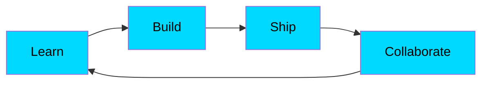

<div align="center">


<a href="https://git.io/typing-svg">
  
</a>

<br>


</div>


<br>

## 👨‍💻 About Me

I'm an embedded systems and IoT developer who builds the bridge between hardware and software — from raw sensor signals to working, deployable products. My work sits at the intersection of **firmware, connectivity, and applied AI**, and I care about writing code that behaves the same on a dev board as it does in the field.

```javascript
const soham = {
    role: "Embedded Systems & IoT Developer",
    location: "Mumbai, India 🇮🇳",
    languages: {
        proficient: ["C++", "C", "Python"],
        working: ["JavaScript", "Embedded Assembly"],
    },
    domains: [
        "Embedded Systems", "IoT Architecture", "Robotics",
        "Computer Vision", "Sensor Fusion", "Automation"
    ],
    hardware: {
        microcontrollers: ["Arduino", "ESP32", "ESP8266", "Raspberry Pi"],
        sensors: ["DHT22", "MPU6050", "HC-SR04"],
        protocols: ["I2C", "SPI", "UART", "Bluetooth", "WiFi"]
    },
    currentlyBuilding: "IoT systems that make everyday infrastructure smarter",
    lookingFor: "Roles / collaborations in embedded software, IoT, and robotics",
    funFact: "I debug hardware with LEDs and software with console.log() 😄",
    philosophy: "Technology is best when it brings people together 💙"
};
```


## 🧬 Skill Matrix

A quick read for teams scanning my depth vs. breadth — sorted by where I spend the most time.

<div align="center">

| Domain | Stack | Proficiency |
|---|---|:---:|
| **Embedded Programming** | C, C++, Embedded C, Arduino IDE, PlatformIO | ████████░░ 80% |
| **IoT & Connectivity** | ESP32, ESP8266, MQTT, WiFi, Bluetooth, I2C/SPI/UART | ███████░░░ 75% |
| **Computer Vision / AI** | Python, OpenCV, YOLO, Jupyter | ██████░░░░ 65% |
| **Robotics & Automation** | Sensors (MPU6050, HC-SR04, DHT22), Actuators, Motion Control | ███████░░░ 70% |
| **Web / Scripting** | JavaScript, HTML, CSS | █████░░░░░ 55% |
| **Tools & DevOps** | Git, GitHub, VS Code, Docker, CMake | ███████░░░ 70% |

</div>

<div align="center">

**Core Stack**


**Hardware & Embedded**


**Tooling**


</div>


## 📊 GitHub Analytics

<div align="center">


</div>


## 🐍 Contribution Snake

<div align="center">


</div>

> ⚠️ **Setup required (one-time):** this animation is generated by a scheduled GitHub Action, not by GitHub itself — it won't appear until the workflow below exists in your `work4soham/work4soham` repo. See **"Activating the Snake Animation"** at the bottom of this README for the exact file to add.


## 🔥 Featured Projects

<div align="center">

<table>
<tr>
<td width="50%">

### 🤖 [Arduino](https://github.com/work4soham/Arduino)
Microcontroller & embedded systems experiments — hardware interfacing, sensor integration, and low-level control logic.
`C++` `Arduino IDE` `Embedded`

</td>
<td width="50%">

### 🎯 [YOLO Object Detection](https://github.com/work4soham/Yolo_Object-Detection)
Real-time object detection pipeline built around the YOLO architecture for vision-driven automation.
`Python` `Computer Vision` `YOLO`

</td>
</tr>
<tr>
<td width="50%">

### 🖐️ [Hand Gesture Control](https://github.com/work4soham/Hand_gesture-src-code)
Touchless system-volume control driven entirely by real-time hand-gesture recognition.
`Python` `OpenCV` `HCI`

</td>
<td width="50%">

### 💬 [AI ChatBot](https://github.com/work4soham/AI_ChatBot_Python-master)
Conversational AI assistant prototyped and iterated inside a Jupyter Notebook workflow.
`Python` `Jupyter` `NLP`

</td>
</tr>
<tr>
<td colspan="2">

### 📋 [AI Project Manager](https://github.com/work4soham/Ai-Project-Manager)
An AI-assisted project management tool aimed at automating planning and tracking overhead.
`Python` `Automation` `AI`

</td>
</tr>
</table>

</div>


## 🎯 Roadmap


```mermaid
graph LR
    A[Learn] --> B[Build]
    B --> C[Ship]
    C --> D[Collaborate]
    D --> A
    style A fill:#00D9FF,color:#000
    style B fill:#00D9FF,color:#000
    style C fill:#00D9FF,color:#000
    style D fill:#00D9FF,color:#000
```

- [ ] 🔥 Cross 100+ meaningful GitHub contributions
- [ ] 🚀 Ship 5 production-grade IoT projects
- [ ] 📚 Go deep on ESP32/ESP8266 low-power design
- [ ] 🤝 Contribute to 10 open-source repositories
- [ ] 📝 Publish technical write-ups on embedded systems
- [ ] 🎓 Complete an advanced embedded systems certification


## 📫 Let's Connect

<div align="center">

<a href="https://github.com/work4soham"></a>
<a href="#"></a>
<a href="#"></a>

<br><br>


</div>


---

### ⚙️ Activating the Snake Animation

The snake graphic above is **not automatic** — GitHub doesn't generate it natively. To make it real:

1. In your `work4soham/work4soham` repo, create `.github/workflows/snake.yml` with:

```yaml
name: Generate Snake

on:
  schedule:
    - cron: "0 0 * * *"   # runs daily at midnight UTC
  workflow_dispatch:

jobs:
  generate:
    runs-on: ubuntu-latest
    steps:
      - uses: Platane/snk@v3
        id: snake-gif
        with:
          github_user_name: work4soham
          outputs: |
            dist/github-contribution-grid-snake.svg
            dist/github-contribution-grid-snake-dark.svg?palette=github-dark

      - uses: crazy-max/ghaction-github-pages@v3
        with:
          target_branch: output
          build_dir: dist
        env:
          GITHUB_TOKEN: ${{ secrets.GITHUB_TOKEN }}
```

2. Commit it, then run it once manually from the **Actions** tab (`workflow_dispatch`) so the `output` branch gets created immediately instead of waiting for midnight UTC.
3. That's it — the SVGs referenced in this README will start rendering your real contribution snake within a few minutes.
